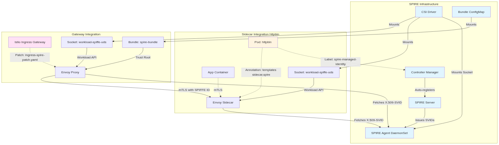

# SPIRE on Minikube + Istio

This guide outlines the steps to set up a Minikube cluster with Kubernetes 1.30+, install Istio, and install SPIRE to issue SPIFFE IDs.

## Specification & Design

### Architecture Overview

This repository implements a **Zero Trust Service Mesh** using SPIRE (SPIFFE Runtime Environment) as the identity provider for Istio workloads on Kubernetes. The architecture replaces Istio's default certificate authority (Istiod) with SPIRE, enabling cryptographic workload identity based on the SPIFFE standard.

```
┌─────────────────────────────────────────────────────────────────┐
│                     Kubernetes Cluster                          │
│                                                                 │
│  ┌──────────────────────────────────────────────────────────┐  │
│  │                    Istio Control Plane                    │  │
│  │  ┌────────────┐                                           │  │
│  │  │  Istiod    │  (Service Discovery, Config Distribution) │  │
│  │  └────────────┘                                           │  │
│  └──────────────────────────────────────────────────────────┘  │
│                                                                 │
│  ┌──────────────────────────────────────────────────────────┐  │
│  │              SPIRE Identity Infrastructure               │  │
│  │  ┌────────────┐         ┌──────────────────────┐         │  │
│  │  │   SPIRE    │◄────────┤  SPIRE Controller    │         │  │
│  │  │   Server   │         │     Manager          │         │  │
│  │  └─────┬──────┘         └──────────────────────┘         │  │
│  │        │                                                  │  │
│  │        │ (Attestation & SVID Issuance)                   │  │
│  │        │                                                  │  │
│  │  ┌─────▼──────┐         ┌──────────────────────┐         │  │
│  │  │   SPIRE    │◄────────┤   SPIRE CSI Driver   │         │  │
│  │  │   Agent    │         │  (Socket Injection)  │         │  │
│  │  └────────────┘         └──────────────────────┘         │  │
│  └──────────────────────────────────────────────────────────┘  │
│                                                                 │
│  ┌──────────────────────────────────────────────────────────┐  │
│  │                  Application Workloads                    │  │
│  │  ┌─────────────────────────────────────────────────┐     │  │
│  │  │  Pod (httpbin)                                  │     │  │
│  │  │  ┌──────────┐  ┌──────────────────────────┐    │     │  │
│  │  │  │   App    │  │    Envoy Sidecar         │    │     │  │
│  │  │  │Container │  │  (SPIRE Socket Mounted)  │    │     │  │
│  │  │  └──────────┘  └──────────────────────────┘    │     │  │
│  │  │       │                    │                    │     │  │
│  │  │       └────────mTLS────────┘                    │     │  │
│  │  │         (SPIFFE ID: spiffe://example.org/...)  │     │  │
│  │  └─────────────────────────────────────────────────┘     │  │
│  └──────────────────────────────────────────────────────────┘  │
└─────────────────────────────────────────────────────────────────┘
```

### Core Components

| Component | Purpose | Configuration |
|-----------|---------|---------------|
| **SPIRE Server** | Issues and manages SPIFFE Verifiable Identity Documents (SVIDs) | `manifest/spire-values.yaml` |
| **SPIRE Agent** | Runs on each node, attests workloads and delivers SVIDs | Deployed via DaemonSet |
| **SPIRE CSI Driver** | Mounts SPIRE Workload API socket into pods | Enabled in Helm values |
| **SPIRE Controller Manager** | Automates workload registration via CRDs | `ClusterSPIFFEID` resources |
| **Istio (Istiod)** | Service mesh control plane, configured to trust SPIRE CA | `manifest/istio-spire-values-fixed.yaml` |
| **Istio Ingress Gateway** | Entry point for external traffic, SPIRE-enabled | `manifest/ingress-spire-patch.yaml` |
| **Keycloak (Optional)** | OIDC provider for token exchange with SPIFFE JWTs | `manifest/keycloak-*.yaml` |

### Identity Flow

1. **Node Attestation**: SPIRE Agent proves its identity to SPIRE Server using Kubernetes Projected Service Account Tokens (PSAT)
2. **Workload Attestation**: SPIRE Agent identifies pods via Kubernetes API and CSI driver
3. **SVID Issuance**: SPIRE Server issues X.509-SVID with SPIFFE ID (e.g., `spiffe://example.org/ns/apps/sa/httpbin`)
4. **Socket Delivery**: SPIRE CSI Driver mounts Workload API socket at `/run/secrets/workload-spiffe-uds/socket`
5. **Envoy Integration**: Istio sidecar fetches SVIDs and the trust bundle via socket (SDS) for mTLS
6. **Trust Validation**: Envoy validates peer certificates using the bundle retrieved from the SPIRE Agent socket

### Key Design Decisions

#### 1. Automated Registration via CRDs
Instead of manual `spire-server entry create` commands, this implementation uses the **SPIRE Controller Manager** with `ClusterSPIFFEID` resources. This enables:
- Declarative workload registration
- Automatic SPIFFE ID generation based on pod metadata
- GitOps-friendly configuration

#### 2. Custom Istio Sidecar Template
The `spire` template in `istio-spire-values-fixed.yaml` ensures every injected sidecar:
- Automatically receives the `spiffe.io/spire-managed-identity: "true"` label
- Mounts the SPIRE Workload API socket via CSI driver
- Configures `ISTIO_META_WORKLOAD_SOCKET_PATH` globally via `proxyMetadata`

Workloads opt-in via annotation: `inject.istio.io/templates: "sidecar,spire"`

#### 3. Ingress Gateway Patching
The Istio Ingress Gateway requires explicit configuration to:
- Trust the SPIRE CA (`caCertificatesPem` annotation)
- Mount the SPIRE socket and bundle
- Register with SPIRE for its own identity

This is handled by `manifest/ingress-spire-patch.yaml`.

#### 4. Federation Support
The architecture supports **multi-cluster federation** where:
- Each cluster maintains its own trust domain (e.g., `alpha.com`, `beta.com`)
- SPIRE Servers exchange trust bundles via `ClusterFederatedTrustDomain` CRDs
- Workloads explicitly declare federation via `federatesWith` field
- Cross-cluster traffic uses Istio East-West Gateways with SNI routing

See `federated-spire.md` for detailed federation design.

### Security Model

| Layer | Mechanism | Enforcement Point |
|-------|-----------|-------------------|
| **Identity** | X.509-SVID with SPIFFE ID | SPIRE Server |
| **Authentication** | Mutual TLS (mTLS) | Envoy Sidecar |
| **Authorization** | Istio AuthorizationPolicy with SPIFFE principals | Envoy RBAC Filter |
| **Trust Root** | SPIRE Bundle (CA Certificate) | SPIRE Agent Socket (SDS) |
| **Attestation** | Kubernetes PSAT + CSI Driver | SPIRE Agent |

### Operational Features

- **Automatic Certificate Rotation**: SPIRE rotates SVIDs every 1 hour (configurable)
- **Zero Downtime Updates**: Envoy fetches new certificates via Workload API without restart
- **Observability**: SPIRE metrics exposed via Prometheus, Istio telemetry via standard mesh tools
- **Day 2 Operations**: See `day-two.md` for cluster name changes, certificate verification, and debugging

### SPIRE Integration Architecture

The following diagram illustrates how SPIRE integrates with Istio to provide workload identity for both sidecars and the ingress gateway:



#### Key Integration Points

**1. SPIRE Infrastructure (Blue)**
- **SPIRE Server**: Central authority that issues X.509-SVIDs with SPIFFE IDs
- **SPIRE Agent**: DaemonSet running on each node, attests workloads and delivers identities
- **CSI Driver**: Mounts the SPIRE Workload API socket into pods automatically
- **Controller Manager**: Automates workload registration using `ClusterSPIFFEID` CRDs
- **Bundle ConfigMap**: Contains the trust root CA certificate for validating identities

**2. Sidecar Integration (httpbin example)**
- Pod labeled with `spiffe.io/spire-managed-identity: "true"` triggers auto-registration
- Annotation `inject.istio.io/templates: "sidecar,spire"` applies custom Istio template
- CSI driver mounts socket at `/run/secrets/workload-spiffe-uds/socket`
- Envoy sidecar fetches X.509-SVID via Workload API (SDS)
- Identity: `spiffe://example.org/ns/apps/sa/httpbin`

**3. Gateway Integration (Ingress Gateway)**
- Gateway deployment patched with SPIRE configuration
- Requires both socket mount (for identity) and bundle mount (for trust validation)
- Annotation `proxy.istio.io/config` with `caCertificatesPem` points to trust root
- Environment variable `ISTIO_META_WORKLOAD_SOCKET_PATH` configures socket location
- Identity: `spiffe://example.org/ns/istio-ingress/sa/istio-ingress`

**4. mTLS Communication**
- Gateway and sidecar both obtain SVIDs from SPIRE Agent
- Both validate peer certificates using the shared trust bundle
- Istio configures Envoy proxies for automatic mTLS with SPIFFE identities
- No manual certificate management required

**Key Differences: Sidecar vs Gateway**
| Aspect | Sidecar | Gateway |
|--------|---------|---------|
| **Configuration** | Automatic via Istio template | Manual patch required |
| **Socket Mount** | CSI driver via template | CSI driver + explicit volumeMount |
| **Trust Bundle** | Fetched via socket (SDS) | Requires ConfigMap mount + annotation |
| **Registration** | Auto via `ClusterSPIFFEID` | Requires explicit `ClusterSPIFFEID` |
| **Complexity** | Low (annotation-based) | Medium (patch + ConfigMap sync) |

### Integration Points

#### Keycloak OIDC (Optional)
Workloads can exchange SPIFFE JWTs for Keycloak access tokens using:
- **SPIFFE Identity Provider**: Native Keycloak support for SPIFFE authentication
- **Federated JWT Authentication**: Client authenticator that validates SPIFFE JWTs
- **SPIRE OIDC Discovery Provider**: Exposes JWKS endpoint for JWT validation
- **Subject-based Client Mapping**: Keycloak clients map to SPIFFE IDs via Subject field

See `integration-keycloak-for-repo.md` for complete setup instructions.

### File Structure

```
.
├── Readme.md                          # Main setup guide (this file)
├── manifest/
│   ├── spire-values.yaml              # SPIRE Helm configuration
│   ├── istio-spire-values-fixed.yaml  # Istio + SPIRE integration config (FIXED)
│   ├── istio-spire-values.yaml        # Istio + SPIRE integration config (Legacy/Broken)
│   ├── ingress-spire-patch.yaml       # Ingress Gateway SPIRE enablement
│   ├── httpbin-spire.yaml             # Sample workload with SPIRE template
│   ├── sleep-spire.yaml               # Debug pod with SPIRE socket
│   ├── debug-spire.yaml               # Ubuntu-based debug pod for Keycloak integration
│   ├── keycloak-*.yaml                # Keycloak deployment manifests
├── federated-spire.md                 # Multi-cluster federation guide
├── day-two.md                         # Operational procedures
├── GatewaySpire.md                    # Ingress Gateway deep dive
├── integration-keycloak-for-repo.md   # Keycloak + SPIFFE integration guide
├── integration-keycloak.md            # Keycloak OIDC integration (legacy)
├── register-httpbin.sh                # Manual registration script (legacy)
└── istio-1.28.3/                      # Istio distribution
```

### Prerequisites & Versions

- **Kubernetes**: 1.30.0+
- **Istio**: 1.28.3 (installed via Helm)
- **SPIRE**: 0.26.0 (Helm chart)
- **SPIRE CRDs**: 0.4.0
- **Keycloak**: 26.2+ (optional)

---

## Prerequisites

- [Minikube](https://minikube.sigs.k8s.io/docs/start/)
- [Kubectl](https://kubernetes.io/docs/tasks/tools/)
- [Helm](https://helm.sh/docs/intro/install/)
- [Istioctl](https://istio.io/latest/docs/setup/getting-started/#download)

## Step 1: Start Minikube

Start Minikube with Kubernetes version 1.30.0 (or newer). We allocate sufficient resources.

```bash
minikube start --kubernetes-version=v1.30.0 --cpus=4 --memory=8192 --driver=docker
```

## Step 2: Install Istio

We will use Helm to install Istio components (Base, Istiod, and Ingress Gateway) separately.

```bash
# Add Istio Helm repo
helm repo add istio https://istio-release.storage.googleapis.com/charts
helm repo update

# 1. Install Istio Base (CRDs)
helm install istio-base istio/base -n istio-system --create-namespace

# 2. Install Istiod (Control Plane) with SPIRE integration
helm install istiod istio/istiod -n istio-system --wait -f manifest/istio-spire-values-fixed.yaml
```

### Understanding `manifest/istio-spire-values-fixed.yaml`

The values provided to Helm configure Istio to integrate natively with SPIRE:

- **Centralized Metadata**: `meshConfig.defaultConfig.proxyMetadata.ISTIO_META_WORKLOAD_SOCKET_PATH` ensures every injected sidecar knows exactly where the SPIRE socket is located.
- **SDS for Trust**: Unlike the legacy configuration, this uses **Secret Discovery Service (SDS)** to fetch the trust bundle via the socket, eliminating the need for manual ConfigMap syncing.
- **Custom Sidecar Template**: `sidecarInjectorWebhook.templates.spire` defines a named template that:
    - Automatically labels pods with `spiffe.io/spire-managed-identity: "true"`.
    - Mounts the **SPIRE Agent socket** via the CSI driver.

To use this template, workloads must be annotated with `inject.istio.io/templates: "sidecar,spire"`.

```bash
# 3. Install Istio Ingress Gateway
helm install istio-ingress istio/gateway -n istio-ingress --create-namespace --wait

# 4. Patch Ingress Gateway for SPIRE Trust
kubectl apply -f manifest/ingress-spire-patch.yaml

# Label the default namespace for injection
kubectl label namespace default istio-injection=enabled
```

## Step 3: Install SPIRE

We will use the official SPIRE Helm charts to install the SPIRE Server and Agent.

```bash
# Add the SPIFFE Helm repo
helm repo add spiffe https://spiffe.github.io/helm-charts-hardened/
helm repo update

# Install SPIRE CRDs
# Note: Version 0.5.0+ is required for compatibility with spire 0.26.0+ due to the 'hint' field
helm upgrade --install spire-crds spiffe/spire-crds \
  --namespace spire-server \
  --create-namespace \
  --version 0.5.0 \
  --wait

# Install SPIRE (Server and Agent) with CSI driver enabled
helm upgrade --install spire spiffe/spire \
  --namespace spire-server \
  --version 0.26.0 \
  -f manifest/spire-values.yaml \
  --wait

> **Troubleshooting**: If you see an error like `field not declared in schema` for `.spec.hint`, ensure `spire-crds` is at version `0.5.0` or higher.
```

### Register Cluster SPIFFE ID
```bash
kubectl apply -f - <<EOF
apiVersion: spire.spiffe.io/v1alpha1
kind: ClusterSPIFFEID
metadata:
  name: istio-ingress
spec:
  spiffeIDTemplate: "spiffe://{{ .TrustDomain }}/ns/{{ .PodMeta.Namespace }}/sa/{{ .PodSpec.ServiceAccountName }}"
  workloadSelectorTemplates:
    - "k8s:ns:istio-ingress"
    - "k8s:sa:istio-ingress"
EOF
```

### Register Cluster SPIFFE ID for Sidecars (Auto-registration)
This will auto-register any pod with the `spiffe.io/spire-managed-identity: "true"` label in the `apps` namespace.

```bash
kubectl apply -f - <<EOF
apiVersion: spire.spiffe.io/v1alpha1
kind: ClusterSPIFFEID
metadata:
  name: istio-sidecar-reg
spec:
  spiffeIDTemplate: "spiffe://{{ .TrustDomain }}/ns/{{ .PodMeta.Namespace }}/sa/{{ .PodSpec.ServiceAccountName }}"
  podSelector:
    matchLabels:
      spiffe.io/spire-managed-identity: "true"
  workloadSelectorTemplates:
    - "k8s:ns:apps"
EOF
```

### Create SPIRE Bundle ConfigMap for Istio Ingress
Export the SPIRE CA bundle and create a ConfigMap in the `istio-ingress` namespace. This is required for the Ingress Gateway to validate backend certificates.

```bash
# Export CA bundle from SPIRE Server
kubectl exec -n spire-server spire-server-0 -c spire-server -- \
  /opt/spire/bin/spire-server bundle show -format pem > /tmp/root-cert.pem

# Create ConfigMap in istio-ingress namespace
kubectl create configmap spire-bundle \
  --from-file=root-cert.pem=/tmp/root-cert.pem \
  -n istio-ingress
```

## Step 4: Verify Installation

### Check Pods
```bash
kubectl get pods -n istio-system
kubectl get pods -n istio-ingress
kubectl get pods -n spire-server
```

## Step 5: Deploy HttpBin (SPIRE Enabled)

Deploy the `httpbin` sample application. This manifest includes the necessary annotations and Envoy filters to trust SPIRE.

```bash
# 1. Create apps namespace and label it
kubectl create ns apps || true
kubectl label namespace apps istio-injection=enabled --overwrite

# 2. Deploy httpbin
kubectl apply -f manifest/httpbin-spire.yaml
```

> **Note**: `manifest/httpbin-spire.yaml` uses the `inject.istio.io/templates: "sidecar,spire"` annotation to apply the SPIRE template configured in Step 2.

```bash
# 3. Verify SPIRE Registration
# With ClusterSPIFFEID, registration is automatic. Check the SPIRE server:
kubectl exec -n spire-server spire-server-0 -- /opt/spire/bin/spire-server entry show -spiffeID spiffe://example.org/ns/apps/sa/httpbin
```

## Step 6: Test Sleep Client

```bash
kubectl apply -f manifest/sleep-spire.yaml
```

## Step 7: Keycloak + SPIFFE Integration (Optional)

### Deploy Keycloak

```bash
kubectl apply -f manifest/keycloak-spiffe-integration.yaml
```

### Configure Keycloak

#### 1. Update Keycloak Deployment
Ensure your `manifest/keycloak-for-spiffee.yaml` includes:

```yaml
- name: KC_FEATURES
  value: "token-exchange,token-exchange-standard:v2,admin-fine-grained-authz:v1,spiffe,client-auth-federated"
- name: KC_TRUSTSTORE_PATHS
  value: "/var/run/secrets/spire-bundle/root-cert.pem"
```

#### 2. Configure SPIFFE Identity Provider
- Go to **Identity Providers** → **Add provider** → **SPIFFE**
- **Alias**: `spiffe`
- **Bundle Endpoint**: `http://spire-spiffe-oidc-discovery-provider.spire-server.svc.cluster.local/keys`
- **Accept Untrusted Certificates**: Enable for testing (or use `KC_TRUSTSTORE_PATHS`)

#### 3. Create Workload Client
- **Client ID**: `workload-client` (or any name)
- **Client Authentication**: **ON** (Confidential)
- **Service Accounts Roles**: **ON**
- **Credentials Tab**:
  - **Client Authenticator**: **Federated Json Web Token**
  - **Identity Provider Alias**: `spiffe`
  - **Subject**: `spiffe://example.org/ns/apps/sa/debug-spire`

#### 4. Deploy Debug Pod
To verify the integration, deploy a debug pod that has access to the SPIRE workload socket and the `spire-agent` CLI.

```bash
kubectl apply -f manifest/debug-spire.yaml
```

The `debug-spire` pod is configured with:
- **Base Image**: `ubuntu:latest`.
- **Label**: `spiffe.io/spire-managed-identity: "true"` for auto-registration.
- **Annotation**: `inject.istio.io/templates: "sidecar,spire"` to mount the SPIRE socket.
- **Setup**: On startup, the pod installs `curl`, `jq`, and downloads the `spire-agent` binary from the official SPIFFE releases, placing it in `/usr/local/bin` for easy access.

### Testing the Flow

**Important**: 
- The `audience` when fetching JWT must be the Keycloak Realm URL
- The `client_id` in the request must be the SPIFFE ID (not the Keycloak Client ID)

```bash
# 1. Fetch JWT SVID with correct audience
TOKEN=$(kubectl exec -n apps debug-spire -c tools -- spire-agent api fetch jwt \
  -audience http://keycloak.spire-server.svc:8080/realms/spire-demo \
  -socketPath /run/secrets/workload-spiffe-uds/socket \
  -format json | jq -r '.svids[0].token')

# 2. Exchange SVID for Keycloak Token
kubectl exec -n apps debug-spire -c tools -- curl -X POST -s http://keycloak.spire-server.svc:8080/realms/spire-demo/protocol/openid-connect/token \
    -d "grant_type=client_credentials" \
    -d "client_id=spiffe://example.org/ns/apps/sa/debug-spire" \
    -d "client_assertion_type=urn:ietf:params:oauth:client-assertion-type:jwt-spiffe" \
    -d "client_assertion=$TOKEN" | jq .
```

### Authenticating Different Workloads

To authenticate a different workload (e.g., `spiffe://example.org/ns/apps/sa/another-app`):

1. Create a new Keycloak Client
2. Set **Credentials → Subject** to the new SPIFFE ID
3. Set **Credentials → Identity Provider Alias** to `spiffe`
4. Use the SPIFFE ID as `client_id` in the token request

For detailed configuration, see `integration-keycloak-for-repo.md`.

## OIDC Customization

### Using Localhost or Custom Domains
By default, the OIDC Discovery Provider validates the `Host` header. To use `localhost` (e.g., when using `kubectl port-forward`), you must update its configuration:

1.  **Edit the ConfigMap**:
    ```bash
    kubectl edit configmap -n spire-server spire-spiffe-oidc-discovery-provider
    ```
2.  **Add `localhost` to the `domains` list** in `oidc-discovery-provider.conf`.
3.  **Restart the Pod**:
    ```bash
    kubectl rollout restart deployment -n spire-server spire-spiffe-oidc-discovery-provider
    ```

### Enabling HTTP (Instead of HTTPS)
The provider is configured for HTTPS by default. To allow HTTP:

1.  **Update ConfigMap**: Add `"insecure_addr": ":8080"` to the `oidc-discovery-provider.conf` section.
2.  **Update Deployment**: Add `containerPort: 8080` to the `spiffe-oidc-discovery-provider` container.
3.  **Update Service**: Add a port mapping for HTTP (e.g., port 80 to targetPort 8080).

For more details, see `oidc-provider-spiffe.md`.

### Useful commands for SPIRE Server

```bash
# List all registration entries
kubectl exec -n spire-server spire-server-0 -- /opt/spire/bin/spire-server entry show
```
