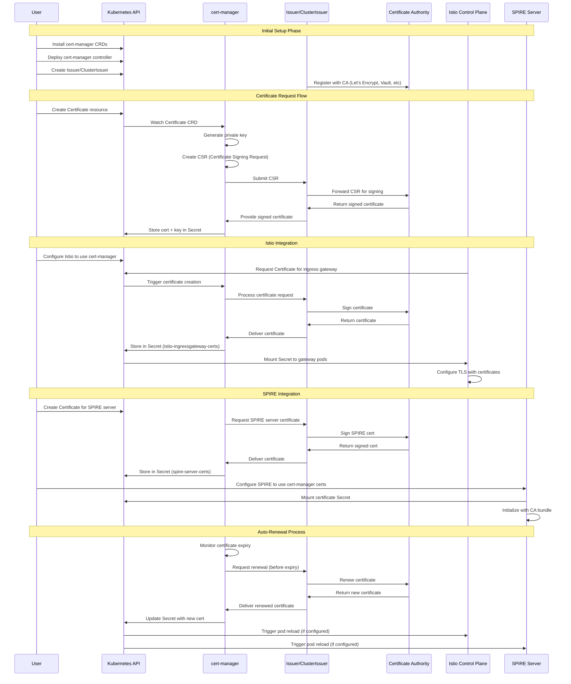
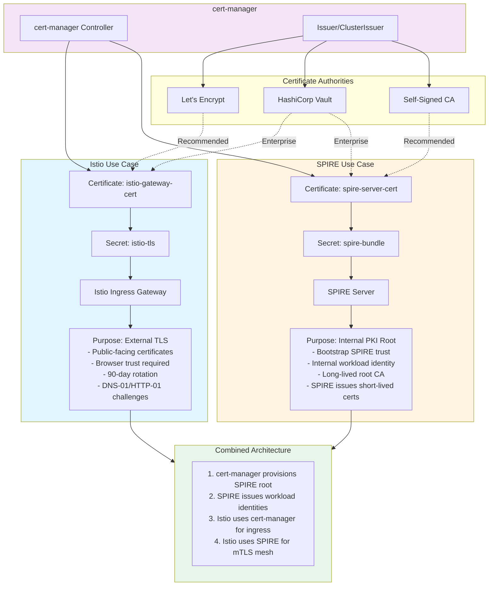

# Kubernetes Brainstorming - cert-manager with Istio and SPIRE

## cert-manager Flow in Kubernetes with Istio and SPIRE

This diagram illustrates the complete lifecycle of certificate management using cert-manager in a Kubernetes cluster, including integration with Istio service mesh and SPIRE for workload identity.



## Key Concepts

### cert-manager Components

- **Certificate CRD**: Kubernetes custom resource that defines a certificate request
- **Issuer/ClusterIssuer**: Represents a certificate authority (CA) that can sign certificates
- **cert-manager Controller**: Watches Certificate resources and manages their lifecycle

### Integration Points

#### Istio Integration
- cert-manager provisions TLS certificates for Istio ingress gateways
- Certificates are stored as Kubernetes Secrets and mounted to gateway pods
- Enables automatic certificate rotation for external-facing services

#### SPIRE Integration
- SPIRE server can use cert-manager for its own TLS certificates
- Provides a trusted root CA for SPIRE's workload identity system
- Separates concerns: cert-manager handles certificate lifecycle, SPIRE handles workload identity

### Certificate Lifecycle

1. **Initial Setup**: Install cert-manager, configure issuers
2. **Certificate Request**: Create Certificate resource, cert-manager generates CSR
3. **Signing**: Issuer forwards CSR to CA, receives signed certificate
4. **Storage**: Certificate and private key stored in Kubernetes Secret
5. **Auto-Renewal**: cert-manager monitors expiry and renews before expiration
6. **Pod Reload**: Applications reload to use new certificates

## Use Cases

### For Istio
- Secure ingress gateway with valid TLS certificates
- Automatic certificate rotation without downtime
- Support for multiple certificate authorities (Let's Encrypt, Vault, etc.)

### For SPIRE
- Bootstrap SPIRE server with trusted certificates
- Establish root of trust for workload identity
- Integrate with existing PKI infrastructure


---

## cert-manager: Istio vs SPIRE Use Cases

This diagram compares how cert-manager is used differently for Istio and SPIRE, and shows how they can work together.



## Key Differences

### Istio Use Case: External TLS Certificates

**Purpose**: Secure external traffic entering the cluster

**Certificate Authority**: 
- Let's Encrypt (recommended for public certificates)
- HashiCorp Vault (enterprise PKI)

**Certificate Characteristics**:
- Public-facing certificates
- Must be trusted by browsers/clients
- Shorter validity (typically 90 days with Let's Encrypt)
- Requires DNS-01 or HTTP-01 ACME challenges
- Automatic renewal by cert-manager

**Flow**:
1. cert-manager creates Certificate resource for Istio gateway
2. Issuer requests certificate from Let's Encrypt/Vault
3. Certificate stored in Kubernetes Secret
4. Istio ingress gateway mounts the Secret
5. Gateway serves TLS traffic with valid certificate

### SPIRE Use Case: Internal PKI Root

**Purpose**: Bootstrap SPIRE's trust domain and workload identity system

**Certificate Authority**:
- Self-signed CA (recommended for internal root)
- HashiCorp Vault (enterprise integration)

**Certificate Characteristics**:
- Internal-only certificates
- Root CA for SPIRE trust domain
- Longer validity (years, not days)
- No external validation required
- SPIRE then issues short-lived workload certificates (seconds to hours)

**Flow**:
1. cert-manager creates root CA certificate for SPIRE
2. Certificate stored in Kubernetes Secret
3. SPIRE server mounts the Secret as its trust bundle
4. SPIRE uses this root to issue workload identities
5. Workloads get short-lived SVIDs (SPIFFE Verifiable Identity Documents)

## Combined Architecture: Best of Both Worlds

You can use both approaches together:

### 1. cert-manager provisions SPIRE root
- Use cert-manager to create and manage SPIRE's root CA certificate
- Benefit from cert-manager's automation and renewal capabilities
- Integrate with enterprise PKI (Vault) if needed

### 2. SPIRE issues workload identities
- SPIRE handles service-to-service authentication
- Issues short-lived certificates (automatic rotation)
- Provides cryptographic workload identity (SPIFFE)

### 3. Istio uses cert-manager for ingress
- Public-facing ingress gateways get certificates from Let's Encrypt
- Automatic renewal prevents expiration
- Browser-trusted certificates for external users

### 4. Istio uses SPIRE for mTLS mesh
- Internal service mesh uses SPIRE for mTLS
- Automatic certificate rotation (every few hours)
- Strong workload identity without manual certificate management

## Implementation Example

### For Istio Ingress (External TLS)

```yaml
apiVersion: cert-manager.io/v1
kind: Certificate
metadata:
  name: istio-gateway-cert
  namespace: istio-system
spec:
  secretName: istio-tls
  issuerRef:
    name: letsencrypt-prod
    kind: ClusterIssuer
  dnsNames:
    - myapp.example.com
    - "*.myapp.example.com"
```

### For SPIRE Root (Internal PKI)

```yaml
apiVersion: cert-manager.io/v1
kind: Certificate
metadata:
  name: spire-server-cert
  namespace: spire
spec:
  secretName: spire-bundle
  duration: 87600h  # 10 years
  isCA: true
  issuerRef:
    name: selfsigned-issuer
    kind: ClusterIssuer
  commonName: spire-root-ca
  subject:
    organizations:
      - "My Organization"
```

## When to Use Each Approach

### Use cert-manager for Istio when:
- You need publicly trusted certificates
- External clients access your services
- You want automatic Let's Encrypt integration
- You need DNS-based certificate validation

### Use cert-manager for SPIRE when:
- You want to bootstrap SPIRE with a trusted root
- You need integration with enterprise PKI (Vault)
- You want automated root CA rotation
- You're establishing a new trust domain

### Use both together when:
- You have both external and internal traffic
- You want public certificates for ingress AND strong internal identity
- You need different certificate lifecycles for different purposes
- You want defense in depth with multiple security layers


---

## Comparison Table: cert-manager Usage for Istio vs SPIRE

| Aspect | Istio (Ingress Gateway) | SPIRE (Server Root CA) |
|--------|------------------------|------------------------|
| **Primary Purpose** | External TLS termination | Internal PKI root bootstrap |
| **Certificate Type** | Leaf/End-entity certificate | Root CA certificate |
| **Trust Requirement** | Public trust (browser/client) | Internal trust domain |
| **Recommended CA** | Let's Encrypt, Public CA | Self-signed, Vault |
| **Certificate Validity** | 90 days (Let's Encrypt) | 1-10 years |
| **Renewal Frequency** | Every 60 days (auto) | Every 1-5 years (manual consideration) |
| **Renewal Method** | Automatic (cert-manager) | Automatic (cert-manager) |
| **Renewal Trigger** | 2/3 of lifetime (30 days before expiry) | 2/3 of lifetime |
| **DNS/HTTP Challenge** | Required (ACME) | Not required |
| **Secret Name** | `istio-ingressgateway-certs` | `spire-server-ca` |
| **Namespace** | `istio-system` | `spire` |
| **Pod Restart Required** | Yes (or use SDS) | Yes |
| **Downtime Risk** | Low (with proper config) | Low (SPIRE handles gracefully) |
| **Certificate Chain** | Full chain from public CA | Self-contained root |
| **Use in Service Mesh** | Ingress only | All workload identities |
| **Rotation Impact** | External clients only | All SPIRE-issued certificates |
| **Monitoring Priority** | High (public-facing) | Critical (trust root) |

## Renewal Strategies

### Best Practices for Istio Certificate Renewal

#### 1. Automatic Renewal Configuration

```yaml
apiVersion: cert-manager.io/v1
kind: Certificate
metadata:
  name: istio-gateway-cert
  namespace: istio-system
spec:
  secretName: istio-ingressgateway-certs
  duration: 2160h    # 90 days
  renewBefore: 720h  # 30 days before expiry
  issuerRef:
    name: letsencrypt-prod
    kind: ClusterIssuer
  dnsNames:
    - myapp.example.com
  privateKey:
    algorithm: RSA
    size: 2048
    rotationPolicy: Always  # Generate new key on renewal
```

#### 2. Gateway Configuration for Zero-Downtime

```yaml
apiVersion: networking.istio.io/v1beta1
kind: Gateway
metadata:
  name: public-gateway
  namespace: istio-system
spec:
  selector:
    istio: ingressgateway
  servers:
  - port:
      number: 443
      name: https
      protocol: HTTPS
    tls:
      mode: SIMPLE
      credentialName: istio-ingressgateway-certs  # Matches Certificate secretName
    hosts:
    - myapp.example.com
```

#### 3. Monitoring and Alerts

```yaml
# Prometheus alert example
- alert: IstioGatewayCertExpiringSoon
  expr: certmanager_certificate_expiration_timestamp_seconds{name="istio-gateway-cert"} - time() < 604800
  for: 1h
  annotations:
    summary: "Istio gateway certificate expiring in less than 7 days"
```

### Best Practices for SPIRE Certificate Renewal

#### 1. Long-Lived Root CA Configuration

```yaml
apiVersion: cert-manager.io/v1
kind: Certificate
metadata:
  name: spire-root-ca
  namespace: spire
spec:
  secretName: spire-server-ca
  duration: 87600h      # 10 years
  renewBefore: 43800h   # 5 years before expiry (50%)
  isCA: true
  commonName: spire-root-ca
  subject:
    organizations:
      - "My Organization"
  usages:
    - digital signature
    - key encipherment
    - cert sign
  issuerRef:
    name: selfsigned-issuer
    kind: ClusterIssuer
  privateKey:
    algorithm: RSA
    size: 4096
    rotationPolicy: Always
```

#### 2. SPIRE Server Configuration

```yaml
# spire-server configmap
server {
  trust_domain = "example.org"
  
  ca_subject = {
    country = ["US"],
    organization = ["My Organization"],
    common_name = "SPIRE Server",
  }
  
  # Use cert-manager provided CA
  ca_key_type = "rsa-4096"
  
  # Intermediate CA configuration
  default_x509_svid_ttl = "1h"
  ca_ttl = "24h"
}
```

#### 3. Graceful Root Rotation Strategy

**Option A: Automated with Monitoring**
- Let cert-manager handle renewal automatically
- SPIRE server detects new certificate in mounted Secret
- Restart SPIRE server pods (use rolling update)
- Old certificates remain valid until workloads refresh

**Option B: Manual Control for Critical Systems**
```yaml
apiVersion: cert-manager.io/v1
kind: Certificate
metadata:
  name: spire-root-ca
  namespace: spire
  annotations:
    cert-manager.io/issue-temporary-certificate: "false"  # Wait for manual approval
spec:
  # ... same as above
```

#### 4. Root CA Rotation Process

1. **Preparation Phase** (6 months before expiry)
   - Verify cert-manager will renew automatically
   - Test SPIRE server restart procedure
   - Document rollback plan

2. **Renewal Phase** (automatic at renewBefore threshold)
   - cert-manager creates new certificate
   - Updates Secret with new CA cert and key
   - Kubernetes triggers pod restart (if configured)

3. **Propagation Phase** (after restart)
   - SPIRE server loads new root CA
   - Issues new intermediate CA
   - Workloads gradually get new SVIDs
   - Old SVIDs remain valid until expiry (1 hour default)

4. **Verification Phase**
   - Check all workloads have new certificates
   - Verify mTLS connections working
   - Monitor for authentication failures

## Renewal Comparison

| Feature | Istio Renewal | SPIRE Renewal |
|---------|--------------|---------------|
| **Frequency** | Monthly (every 60 days) | Rare (every 5+ years) |
| **Automation Level** | Fully automatic | Automatic with monitoring |
| **Risk Level** | Low | Medium (trust root change) |
| **Testing Required** | Minimal | Extensive |
| **Rollback Complexity** | Easy | Complex |
| **Client Impact** | None (transparent) | None (if done correctly) |
| **Preparation Time** | None | 6+ months |
| **Best Practice** | Let it auto-renew | Monitor and plan ahead |

## Monitoring Commands

### Check Certificate Status

```bash
# Check Istio certificate
kubectl get certificate -n istio-system istio-gateway-cert -o yaml

# Check SPIRE certificate
kubectl get certificate -n spire spire-root-ca -o yaml

# Check certificate expiry
kubectl get certificate -A -o custom-columns=\
NAME:.metadata.name,\
NAMESPACE:.metadata.namespace,\
READY:.status.conditions[0].status,\
EXPIRY:.status.notAfter
```

### Verify Certificate in Secret

```bash
# Istio certificate
kubectl get secret -n istio-system istio-ingressgateway-certs -o jsonpath='{.data.tls\.crt}' | \
  base64 -d | openssl x509 -noout -text

# SPIRE certificate
kubectl get secret -n spire spire-server-ca -o jsonpath='{.data.tls\.crt}' | \
  base64 -d | openssl x509 -noout -text
```

### Force Manual Renewal

```bash
# Force renewal (if needed)
kubectl annotate certificate -n istio-system istio-gateway-cert \
  cert-manager.io/issue-temporary-certificate="true" --overwrite

# Delete and recreate (emergency)
kubectl delete secret -n istio-system istio-ingressgateway-certs
# cert-manager will automatically recreate
```

## Key Takeaways

1. **Istio**: Set it and forget it - automatic renewal works well for short-lived public certificates
2. **SPIRE**: Plan ahead - root CA renewal is infrequent but requires careful coordination
3. **Both**: Use cert-manager's automatic renewal, but monitor certificate expiry dates
4. **Best Practice**: Always test renewal procedures in non-production environments first
