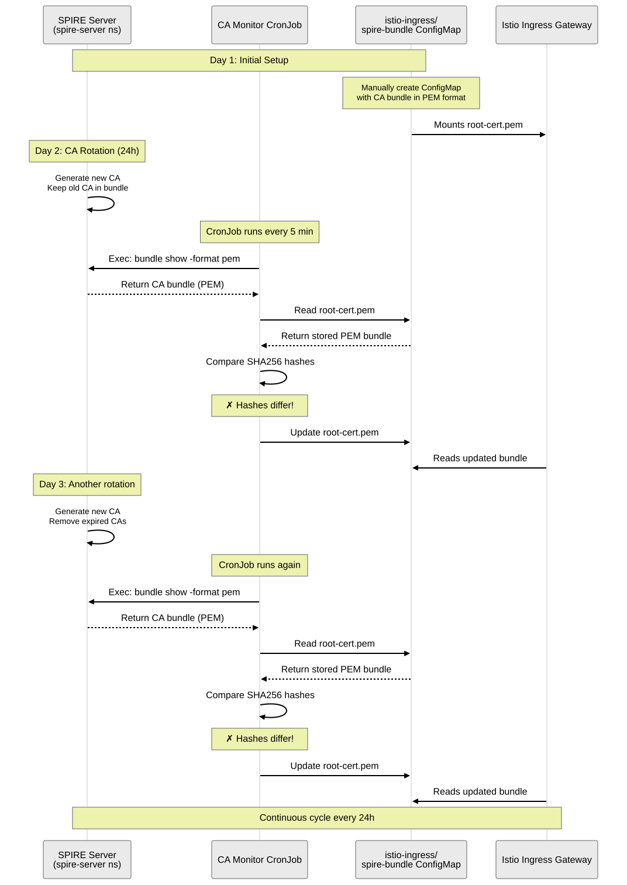

# SPIRE + Istio Integration: Improved Implementation Guide

This document details the specific, verified changes required to integrate SPIRE as the identity provider for Istio 1.28 on Kubernetes 1.30+. These changes replace legacy or broken configurations with the official SDS-based (Secret Discovery Service) approach.

## 1. Corrected Istio Helm Values
**File:** `manifest/istio-spire-values-fixed.yaml`

The critical change here is moving the socket configuration to `proxyMetadata` and using `initContainers` for native sidecar compatibility.

```yaml
meshConfig:
  trustDomain: "example.org"
  defaultConfig:
    proxyMetadata:
      # Centralized socket path for Envoy SDS
      ISTIO_META_WORKLOAD_SOCKET_PATH: /run/secrets/workload-spiffe-uds/socket

sidecarInjectorWebhook:
  templates:
    spire: |
      labels:
        # REQUIRED: Trigger SPIRE Controller Manager registration
        spiffe.io/spire-managed-identity: "true"
      spec:
        # For K8s 1.29+, the sidecar is a native sidecar (initContainer)
        initContainers:
        - name: istio-proxy
          volumeMounts:
          - name: workload-socket
            mountPath: /run/secrets/workload-spiffe-uds
            readOnly: true
        volumes:
          - name: workload-socket
            csi:
              driver: "csi.spiffe.io"
              readOnly: true
```

### Key Differences:
*   **Native Sidecar Support**: Uses `initContainers` to merge with Istio's native sidecar (required for K8s 1.29+).
*   **Removed `caCertificatesPem`**: Istio now fetches the trust bundle automatically via the SPIRE socket (SDS).
*   **Automated Labeling**: The `labels` section in the template ensures workloads are automatically registered by SPIRE.

---

## 2. Ingress Gateway Patch
**File:** `manifest/ingress-spire-patch.yaml`

The Ingress Gateway requires a specific patch to bridge the gap between Istio's gateway deployment and the SPIRE infrastructure.

```yaml
apiVersion: apps/v1
kind: Deployment
metadata:
  name: istio-ingress
  namespace: istio-ingress
spec:
  template:
    metadata:
      labels:
        spiffe.io/spire-managed-identity: "true"
      annotations:
        # Ingress needs an explicit pointer to the trust root for backend verification
        proxy.istio.io/config: |
          caCertificatesPem:
          - "/var/run/secrets/spire-bundle/root-cert.pem"
        sidecar.istio.io/userVolume: '[{"name":"workload-socket","csi":{"driver":"csi.spiffe.io","readOnly":true}},{"name":"spire-bundle","configMap":{"name":"spire-bundle"}}]'
        sidecar.istio.io/userVolumeMount: '[{"name":"workload-socket","mountPath":"/run/secrets/workload-spiffe-uds","readOnly":true},{"name":"spire-bundle","mountPath":"/var/run/secrets/spire-bundle","readOnly":true}]'
    spec:
      containers:
      - name: istio-proxy
        env:
        - name: ISTIO_META_WORKLOAD_SOCKET_PATH
          value: "/run/secrets/workload-spiffe-uds/socket"
        volumeMounts:
        - name: workload-socket
          mountPath: "/run/secrets/workload-spiffe-uds"
          readOnly: true
        - name: spire-bundle
          mountPath: "/var/run/secrets/spire-bundle"
          readOnly: true
      volumes:
      - name: workload-socket
        csi:
          driver: csi.spiffe.io
          readOnly: true
      - name: spire-bundle
        configMap:
          name: spire-bundle
```

---

## 3. Persistent Ingress Registration
**File:** `manifest/ingress-registration.yaml`

Without this, the Ingress Gateway will fail with: `workload is not authorized for the requested identities ["default"]`.

```yaml
apiVersion: spire.spiffe.io/v1alpha1
kind: ClusterSPIFFEID
metadata:
  name: istio-ingress
spec:
  spiffeIDTemplate: "spiffe://{{ .TrustDomain }}/ns/{{ .PodMeta.Namespace }}/sa/{{ .PodSpec.ServiceAccountName }}"
  podSelector:
    matchLabels:
      istio: ingress
  workloadSelectorTemplates:
    - "k8s:ns:istio-ingress"
    - "k8s:sa:istio-ingress"
```

---

## 4. Simplified Workload Template
**File:** `manifest/httpbin-simple-final.yaml`

Because we have centralized the SPIRE configuration in `istiod`, adding SPIRE to a new workload is now simple:

```yaml
apiVersion: v1
kind: ServiceAccount
metadata:
  name: httpbin-simple
  namespace: apps
---
apiVersion: apps/v1
kind: Deployment
metadata:
  name: httpbin-simple
  namespace: apps
spec:
  replicas: 1
  selector:
    matchLabels:
      app: httpbin-simple
  template:
    metadata:
      labels:
        app: httpbin-simple
      annotations:
        # This triggers the 'spire' template we defined in Helm values
        inject.istio.io/templates: "sidecar,spire"
    spec:
      serviceAccountName: httpbin-simple
      containers:
      - name: httpbin
        image: docker.io/kennethreitz/httpbin
        ports:
        - containerPort: 80
```

---

## 5. SPIRE CA Rotation and Bundle Management

### Understanding SPIRE CA Rotation

SPIRE automatically rotates its CA certificate to maintain security. The rotation behavior is determined by the certificate validity period:

**How the rotation period was discovered:**
```bash
# Check certificate validity from the bundle
kubectl exec -n spire-server spire-server-0 -c spire-server -- \
  /opt/spire/bin/spire-server bundle show -format pem | openssl x509 -noout -dates

# Output shows:
# notBefore=Feb 12 18:43:37 2026 GMT
# notAfter=Feb 13 18:43:47 2026 GMT
```

This reveals a **24-hour validity period** (with 10 seconds grace). SPIRE generates a new CA certificate approximately every 24 hours.

### CA Bundle Structure

The `spire-bundle` ConfigMap contains **multiple CA certificates** (typically 5) in a single PEM file:

```bash
# Count certificates in the bundle
kubectl get configmap spire-bundle -n istio-ingress -o jsonpath='{.data.root-cert\.pem}' | \
  grep -c "BEGIN CERTIFICATE"
# Output: 5
```

**Why multiple certificates?**
- SPIRE keeps old CA certificates in the bundle during rotation
- This provides a grace period where workloads with SVIDs signed by old CAs remain trusted
- Prevents service disruption during CA transitions
- Old certificates are eventually removed after expiration

### The Synchronization Problem

**Without persistence configured**, when minikube or SPIRE pods restart:
1. SPIRE generates a completely new CA (new trust root)
2. The `spire-bundle` ConfigMap in `istio-ingress` namespace becomes stale
3. Eventually all old CAs expire from SPIRE's current bundle
4. mTLS breaks because there's no common trusted CA

**Current state detection:**
```bash
# Compare current SPIRE CA with stored bundle
kubectl logs -n istio-ingress <spire-ca-monitor-pod>

# Example output showing mismatch:
# Current SPIRE CA hash: 76b5b63cb5c6000afdbc7a1524ec2883fe579fb3e96554141af352ae184b9b8a
# Stored CA hash: c98acb18cc60858af5da752d68aec133d7ff94250c8b5a2561deac888877ad2e
# ✗ CA bundle has CHANGED!
```

### Automated Monitoring Solution

The `spire-ca-monitor` CronJob detects CA changes and can automatically update the ConfigMap:

**Key features:**
- Runs every 5 minutes (configurable)
- Fetches current CA bundle from SPIRE server using `spire-server bundle show -format pem`
- Compares SHA256 hash with stored bundle in `spire-bundle` ConfigMap
- Detects when CA rotation occurs or SPIRE restarts with new CA
- Can automatically update the ConfigMap (currently commented out for evaluation)

**To enable automatic updates**, uncomment the update section in `manifest/spire-ca-monitor.yaml`:
```bash
# kubectl create configmap "$CONFIGMAP_NAME" \
#   --from-literal=root-cert.pem="$current_bundle" \
#   --dry-run=client -o yaml | \
#   kubectl apply -n "$TARGET_NAMESPACE" -f -
```

### Long-term Solution: Persistence

For production environments, configure persistent storage for SPIRE Server:

```yaml
# In spire-values.yaml
spire-server:
  persistence:
    enabled: true
    size: 1Gi
    storageClass: standard
```

**Important:** Persistence prevents CA regeneration on restarts, but **does NOT eliminate the need for the CA monitor CronJob**. The CronJob is a permanent infrastructure component because:

1. **Normal CA rotation occurs every 24 hours** (security best practice)
2. SPIRE automatically generates new CA certificates and removes expired ones
3. The `spire-bundle` ConfigMap in `istio-ingress` namespace doesn't auto-update
4. Without synchronization, the ingress gateway will eventually lose trust

### CA Rotation Lifecycle



The diagram above shows the continuous cycle:
- **Day 1**: Initial CA bundle is manually created
- **Day 2**: SPIRE rotates CA (24h period), monitor detects change and updates ConfigMap
- **Day 3**: Another rotation occurs, monitor keeps ConfigMap synchronized
- **Ongoing**: This cycle repeats indefinitely

**Key takeaway:** The CA monitor CronJob is not a workaround - it's a required component for keeping the ingress gateway's trust bundle synchronized with SPIRE's rotating CA certificates.

## 6. Verification Steps for Tomorrow

### Step A: Apply Identity Infrastructure
```bash
# Apply corrected Istio values
helm upgrade istiod istio/istiod -n istio-system -f manifest/istio-spire-values-fixed.yaml

# Apply Ingress Registration
kubectl apply -f manifest/ingress-registration.yaml

# Apply Ingress Patch
kubectl apply -f manifest/ingress-spire-patch.yaml
kubectl rollout restart deployment istio-ingress -n istio-ingress
```

### Step B: Validate SPIFFE Headers
Run a curl through the Ingress to a sidecar-enabled backend:
```bash
kubectl exec -n apps sleep-spire-xxxx -c sleep -- curl -s http://<INGRESS_IP>/headers
```

**Successful Output should include:**
`"X-Forwarded-Client-Cert": "...URI=spiffe://example.org/ns/istio-ingress/sa/istio-ingress"`
