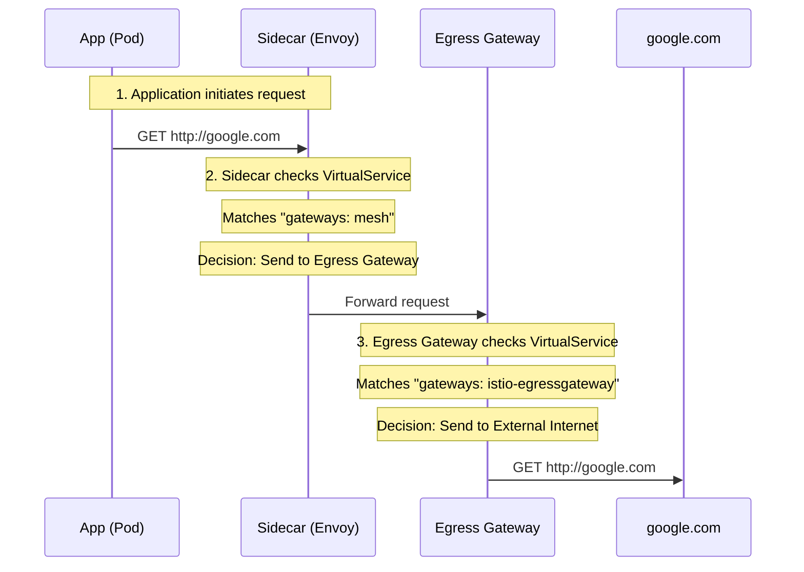

# Istio Gateway Patterns: Ingress, Egress, and East-West

This document explains the three primary gateway patterns in Istio, how to configure them using Helm, and when to use specific networking modes like `LoadBalancer` vs. `NodePort`.

---

## 1. North-South Ingress Gateway (The "Front Door")
**Traffic Flow:** Public Internet → Ingress Gateway → Internal Service.

This is the most common gateway. It handles external requests and typically terminates TLS to inspect headers for routing (VirtualServices).

### Helm Configuration
```bash
helm install istio-ingress istio/gateway 
  -n istio-ingress --create-namespace 
  --set service.type=LoadBalancer 
  --set "service.ports[0].name=http2" 
  --set "service.ports[0].port=80" 
  --set "service.ports[1].name=https" 
  --set "service.ports[1].port=443"
```

### Why LoadBalancer?
In cloud environments, `LoadBalancer` provides a stable External IP. In Minikube, you use `minikube tunnel` to simulate this. 

---

## 2. Egress Gateway (The "Exit Ramp")
**Traffic Flow:** Internal Service → Egress Gateway → External API (e.g., google.com).

By default, Istio sidecars can talk to the internet directly. You use an Egress Gateway when you want **centralized control**:
- To enforce that all outgoing traffic comes from a single IP.
- To perform deep packet inspection or logging on outgoing requests.
- To provide mTLS from the workload to the gateway, even if the final destination is plain text.

### Helm Configuration
```bash
helm install istio-egress istio/gateway 
  -n istio-system 
  --set service.type=ClusterIP # Usually internal only
```

### The "NodePort" Context
If you see documentation suggesting `NodePort` for Egress, it's usually for **on-premise** or restricted environments where a cloud LoadBalancer isn't available, but you need an external firewall to "see" the traffic coming from specific high-numbered ports on your Nodes. However, for most Istio setups, Egress gateways use `ClusterIP` because they are reached internally by the sidecars.

---

## 3. How to Use the Egress Gateway
Installing the gateway is only half the work. To actually force traffic through it, you need to configure Istio to route requests from your sidecars to the gateway.

### Step 1: Define the External Service (`ServiceEntry`)
Istio sidecars need to know about the external destination.

```yaml
apiVersion: networking.istio.io/v1beta1
kind: ServiceEntry
metadata:
  name: google-external
spec:
  hosts:
  - google.com
  ports:
  - number: 80
    name: http
    protocol: HTTP
  resolution: DNS
  location: MESH_EXTERNAL
```

### Step 2: Define the Egress Gateway (`Gateway`)
This tells the `istio-egress` pod to listen for traffic bound for `google.com`.

```yaml
apiVersion: networking.istio.io/v1beta1
kind: Gateway
metadata:
  name: istio-egressgateway
  namespace: istio-system
spec:
  selector:
    istio: egressgateway # Must match the label of your egress pod
  servers:
  - port:
      number: 80
      name: http
      protocol: HTTP
    hosts:
    - google.com
```

### Step 3: Route Traffic via Gateway (`VirtualService`)
This is the "magic" that redirects the sidecar's request to the Egress Gateway instead of going directly to the internet.

```yaml
apiVersion: networking.istio.io/v1beta1
kind: VirtualService
metadata:
  name: google-route
spec:
  hosts:
  - google.com
  gateways:
  - mesh                # Internal sidecars
  - istio-egressgateway # The egress gateway itself
  http:
  - match:
    - gateways:
      - mesh
      port: 80
    route:
    - destination:
        host: istio-egressgateway.istio-system.svc.cluster.local
        port:
          number: 80
  - match:
    - gateways:
      - istio-egressgateway
      port: 80
    route:
    - destination:
        host: google.com
        port:
          number: 80

### Visualizing the Flow
It can be confusing that the same `VirtualService` handles two different steps. Think of it as a set of instructions shared by two different proxies (the Sidecar and the Egress Gateway), where each proxy only follows the instructions meant for it.

```text
[ Application Pod ] 
       |
       | (1) HTTP GET google.com
       v
[ Sidecar Proxy ] <------ VirtualService (gateways: mesh)
       |                  Rule: Route google.com -> Egress Gateway Service
       | (2) Forwarded Traffic
       v
[ Egress Gateway ] <----- 1. Gateway Resource (hosts: google.com)
       |                  2. VirtualService (gateways: istio-egressgateway)
       |                  Rule: Route google.com -> External Internet
       | (3) Real HTTP GET
       v
[  google.com   ]
```



**Why does the Egress Gateway need `google.com` configured in the `Gateway` resource?**
The `Gateway` resource and the `VirtualService` serve two distinct purposes on the Egress pod:

1.  **The `Gateway` is the "Firewall/Listener":** It tells the Egress Gateway proxy (Envoy) to actually open a port and "listen" for traffic specifically bound for `google.com`. If you omit `google.com` from the `Gateway` hosts, the proxy will reject the connection immediately, even if a routing rule exists.
2.  **The `VirtualService` is the "Router":** Once the `Gateway` accepts the traffic, the `VirtualService` tells it where to send it next (the "Real" internet).

Think of the **Gateway** as the security guard checking the destination on your ticket, and the **VirtualService** as the GPS telling you which road to take once you're inside.

**The Routing Logic:**
- **The Sidecar's job:** "I see traffic for `google.com`. My rule says: Don't go to the internet. Go to the Egress Gateway instead."
- **The Egress Gateway's job:** "I just received traffic for `google.com` from a sidecar. My rule says: Go to the real internet."
```

---

## 4. East-West Gateway (The "Bridge")
**Traffic Flow:** Cluster A → East-West Gateway (Cluster B) → Internal Service (Cluster B).

This is used for **Multi-cluster** or **Federated SPIRE** setups. It allows two clusters to talk while maintaining the original identity (SPIFFE ID) of the sender.

### Helm Configuration
Crucially, this gateway needs Port **15443** to be open for specialized mTLS tunneling.

```bash
helm install istio-eastwestgateway istio/gateway 
  -n istio-system 
  --set service.type=LoadBalancer 
  --set "service.ports[0].name=status-port" 
  --set "service.ports[0].port=15021" 
  --set "service.ports[1].name=tls" 
  --set "service.ports[1].port=15443" 
  --set "service.ports[1].targetPort=15443"
```

### The "Secret Sauce": AUTO_PASSTHROUGH
The East-West gateway is unique because it uses a specific Istio `Gateway` resource that tells Envoy **not** to decrypt the traffic. This is how the SPIRE certificate from Cluster A reaches the workload in Cluster B.

```yaml
apiVersion: networking.istio.io/v1beta1
kind: Gateway
metadata:
  name: eastwestgateway
  namespace: istio-system
spec:
  selector:
    istio: eastwestgateway
  servers:
  - port:
      number: 15443
      name: tls
      protocol: TLS
    tls:
      mode: AUTO_PASSTHROUGH # Preserves original client certificate
    hosts:
    - "*.local"
```

---

## Summary Comparison

| Gateway Type | Traffic Direction | Primary Port | Mode | Service Type |
| :--- | :--- | :--- | :--- | :--- |
| **Ingress** | Incoming (External) | 80 / 443 | SIMPLE / MUTUAL | LoadBalancer |
| **Egress** | Outgoing (External) | 80 / 443 | SIMPLE / ISTIO_MUTUAL | ClusterIP |
| **East-West** | Incoming (Cluster) | 15443 | **AUTO_PASSTHROUGH** | LoadBalancer |

### A Note on Minikube & Networking
- **LoadBalancer**: Works if `minikube tunnel` is running.
- **NodePort**: Use this if you cannot run a tunnel. You will reach the gateway via `minikube ip` + the `nodePort` assigned by Kubernetes (usually 30000-32767).